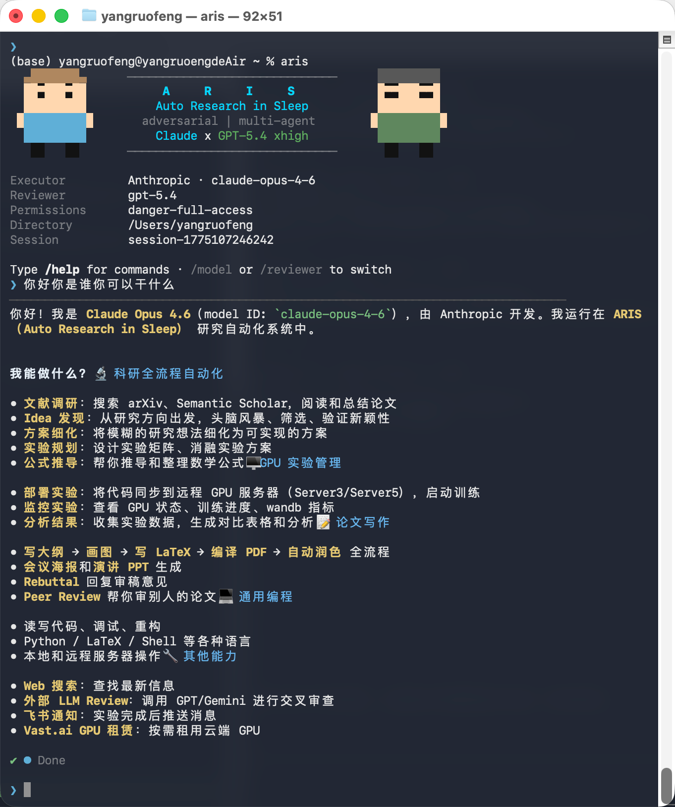

# 🌙 ARIS-Code — Auto Research in Sleep

```
    ░░░░░░░░░░░░░░░░░░░░░░░░░░░░░░░░░░░░░░░░░
    ░  █████╗ ██████╗ ██╗███████╗            ░
    ░ ██╔══██╗██╔══██╗██║██╔════╝            ░
    ░ ███████║██████╔╝██║███████╗            ░
    ░ ██╔══██║██╔══██╗██║╚════██║            ░
    ░ ██║  ██║██║  ██║██║███████║            ░
    ░ ╚═╝  ╚═╝╚═╝  ╚═╝╚═╝╚══════╝           ░
    ░░░░░░░░░░░░░░░░░░░░░░░░░░░░░░░░░░░░░░░░░
         🟦 [Claude]    🟩 [GPT 🕶️]
         executor  ←→  reviewer
         让 AI 边睡边帮你做研究
```



> **对抗·多智能体研究自动化 CLI**
> Executor 执行 · Reviewer 审查 · 迭代精进

[](https://github.com/wanshuiyin/Auto-claude-code-research-in-sleep/releases)
[](https://github.com/wanshuiyin/Auto-claude-code-research-in-sleep)
[](LICENSE)


## 📰 最新动态

> **v0.4.11** (2026-05-18) — **Skills 包刷新 / research workflow 同步 release**。Binary runtime 行为相对 v0.4.10 基本不变；嵌入的 skill 集合追上 `main` 当前状态。**新嵌入 10 个 skill**：`/citation-audit`（第四层文献审计：存在性 + metadata + 引用 context 覆盖）+ `/experiment-queue`（SSH 多 seed 任务队列，含 OOM retry + 残留 screen 清理）+ `/kill-argument`（理论论文双线对抗审）+ `/resubmit-pipeline`（W5：纯文本换会议投稿，含 kill-argument 门）+ `/paper-talk`（端到端 conference talk pipeline）+ `/slides-polish`（逐页 Codex 排版审）+ `/overleaf-sync`（通过 Git bridge 双向同步 Overleaf，token 走 Keychain）+ `/gemini-search` + `/openalex`（更广文献源）+ `/qzcli`（启智平台 GPU 任务管理）。**46 个已有 SKILL.md 刷新** —— 最重要的是 canonical resolver chain 全面铺开（修复真实用户事故：research-wiki 因硬编码 `tools/research_wiki.py` 空了一周）+ submission assurance gate + external verifier 上线（paper-writing Phase 6 现在能跑通）+ proof-checker `--restatement-check` / `--deep-fix` opt-in flag。**Helpers**：tools/ 9 → 18 个；`research_wiki.py` 从 315 行刷到 767 行（含 canonical `ingest_paper` API；否则 SKILL.md 调的 API 在 bundle 里不存在）。**Sync 基础设施**：`tools/sync_main_skills.sh` 自动化 main → bundle rsync（含 symlink 前置检测 + codex-mirror prune + `SKILLS_SOURCE_COMMIT` 钉版本）；3 个新 CI drift test 覆盖全部 4 个 resolver layer pattern。**Gemini MCP** 在 `/research-lit` 改成 `model: 'auto-gemini-3'`。全程 Codex MCP（gpt-5.5 xhigh）4 轮交叉评审。

> **v0.4.10** (2026-05-17) — **流式 + MCP 可靠性 release**。**C6**（关闭 `#228` 那条 "error decoding response body" 中流报错循环）：Anthropic `MessageStream` 和 OpenAI SSE 循环均支持 chunk decode 失败 / 早 EOF 时整段重启请求（`ARIS_STREAM_RETRY`，默认 2，clamp 0..=5，只在尚未输出任何内容时触发，输出不会撕裂）。**M3**（关闭 `#151` / `#172` "Calling codex..." 卡死）：MCP stdio `request()` 加 300s 默认超时同时覆盖 send + read（env `MCP_REQUEST_TIMEOUT_SECS` 覆盖，clamp 1..=1800）；`response.id ↔ request.id` 关联校验；`ensure_server_ready()` 用 `try_wait()` 检测进程死亡并透明 respawn；任何失败路径都 `kill().await` 回收子进程让下次调用从干净状态开始。新增 3 个 MCP regression test。**C8/P4**：OpenAI 流式请求体加 `stream_options.include_usage: true`，解析 `prompt_tokens_details.cached_tokens` → `cache_read_input_tokens`；Anthropic `MessageStart.usage`（含 input + cache 两半）和 `MessageDelta.usage`（含 output）合并，让 post-compaction cache 命中率显示真实数字。**C9** 多 provider 计费：GPT-5.5/5.4/o1/o3/o4（cache_read = input × 0.1，OpenAI 实际 prefix-cache 折扣——此前 generic 50% 高估了 5 倍）、Gemini 2.5/2.0、DeepSeek V3/V4/R1（区分 cache_hit / cache_miss）、GLM、MiniMax、Kimi/Moonshot、MiMo、Qwen、Doubao；`has_word()` 边界匹配让 `openai/o3-mini` / `provider/<model>` 正确路由 tier。**清理**：9 个 dead-code warning 修复，`aris setup` help 文案 + doctor 字符串与实际行为同步，对 v0.4.10 触及的 7 个文件跑 `cargo fmt`。全程 Codex MCP（gpt-5.5 xhigh）交叉评审。

> **v0.4.9** (2026-05-17) — **关闭 Codex v0.4.7 audit 残留 (L1+L3+L4)** + skill-helper 子系统收尾。**L1**：`tools` crate 也切到 `native-tls`，三个 reqwest 消费者 TLS 统一（DashScope 类 endpoint 走 LlmReview reviewer path 也能用了，不只是主 executor）。Linux CI 装 OpenSSL dev headers。**L3**：ApiClient trait 加 `on_session_compacted()`；OpenAI message-index-keyed reasoning_cache 在 auto-compaction 后清空，post-compaction replay 不再 aim 错误 index。**L4**：拆 `supports_reasoning_content_replay` predicate（超集含 Kimi/Moonshot/Xiaomi-MiMo/DeepSeek-R1 — 这些 emit reasoning_content 但不接受 reasoning_effort）+ 32K char 单 turn cap + 128K char 总 cache cap（oldest-eviction）。另：2 个新 skill 嵌入（`/figure-spec` + `/paper-illustration-image2` 含 `scripts/` 子目录，新 resolver Layer 0b = `$ARIS_CACHE_DIR/skills/<name>/scripts/`）；`research_wiki.py` 从 skill-local 提升到 shared `tools/`（9+ 调用方）；5 个 SKILL.md 迁移到 fallback chain（`exa-search`, `semantic-scholar`, `arxiv`, `idea-creator`）；inventory cargo test + smoke shell 脚本防 H6 regression。

> **v0.4.8** (2026-05-17) — **Skill helper 子系统重写** + **两个社区 bug 修复**。Bundled helper 现在 startup 时提取到 `~/.config/aris/cache/<version>/`（而不是 cwd）；每次 Skill 调用都会输出 `helperReport`（含 cache dir + 4 层 resolver preamble）。`/skills export` 一并导出 helper。新 `integration-contract.md` 定义 6 个失败策略（A gate / B side-effect / C forensic / D1 cascade / D2 multi-source / E diagnostic）。8 个 shared helper（arxiv/deepxiv/exa/S2/openalex fetcher + save_trace + verify_papers + verify_paper_audits）嵌入二进制。`/research-lit` + `/deepxiv` SKILL.md 迁移到 fallback chain。修复：(a) `gpt-5.5 + tools` 在 OpenAI 400 错误（gpt-5.5/o3/o4 + tools 时剥离 `reasoning_effort`），(b) Custom reviewer 每次启动变 gpt-5.5（`/setup` 菜单选项 9 vs 8 bug + `LlmReview` 不再为 Custom fallback gpt-5.5）。

> **v0.4.7** (2026-05-16) — **DashScope Coding Plan 405 修复**（#159）通过 `native-tls` 切换 — 贡献者 [@GetIT-Sunday](https://github.com/GetIT-Sunday) (#225) | **所有 reasoning model 的 `reasoning_content` replay**（OpenAI o1/o3/o4、DeepSeek-R1 等），不再只是 Kimi — 配合 v0.4.5 `reasoning_effort='xhigh'` 让多轮 reasoning 对话连贯 — 贡献者 [@GetIT-Sunday](https://github.com/GetIT-Sunday) (#226) | 清理：删除 600+ 行 `rusty-claude-cli` 原型死代码（`app.rs` / `args.rs` / `runtime/sse.rs`）+ 未使用的 `rustyline` 依赖 + 用户面 "Claw Code" → "ARIS-Code" 品牌统一。

> **v0.4.6** (2026-05-14) — **🚨 两个长期静默 bug 修复**：(1) `PermissionMode::Prompt` 因 derived-`Ord` 顺序错误**一直在静默放过所有 tool 调用**（用户选"问我"实际等同直接 allow），现在正确路由到 prompter；(2) system prompt 写死 `current_date = "2026-03-31"`，导致 model 把 2026-03 之后所有真实数据（包括用户自己的 arXiv 论文）都判为"未来 / prompt injection"——现在用 `runtime::today_iso()` 真实系统时间。另外 **Custom OpenAI 兼容 provider**（`/setup` 选项 11，reviewer 选项 9）+ dynamic `/models` 自动发现 — 贡献者 [@Anduin9527](https://github.com/Anduin9527) (#221 + #222)。

> **v0.4.5** (2026-05-13) — **推理模型一等公民支持** — `reasoning_effort='xhigh'` 真正发到请求体（GPT-5.5 / o1 / o3 / o4 / DeepSeek-thinking）| **Thinking content blocks** 全链路打通（修 #161 unknown variant + 400 Bad Request）| **多 tool result 合并** 修复（`tool_use_ids_without_tool_result` 并发 tool 错）| **DeepSeek V4 Pro** + **Xiaomi MiMo** + **Qwen 3.6** + **Doubao** 加入 `/setup`（选项 7-10）| **Claude Code 对象式 hooks** 解析器 | 默认模型升级到 **Claude Opus 4.7 + GPT-5.5** | REPL 输入加固：折行不再无限复制 / Cmd+V 多行粘贴不再每行 auto-submit / CJK 字符在折行边界正确渲染 | 新增 CI workflow | 贡献者: [@GO-player-hhy](https://github.com/GO-player-hhy) (#186), [@Jxy-yxJ](https://github.com/Jxy-yxJ) (#171), [@GetIT-Sunday](https://github.com/GetIT-Sunday) (#216 部分)

> **v0.4.4** (2026-04-20) — **`/setup` 配 Claude 中转站不再强制走 Bearer**(修 ModelScope / newcli.com 等只认 x-api-key 的代理) | `/setup` 加入常用第三方代理 URL 提示(OpenRouter / DeepSeek / DashScope / ModelScope 等) | Provider 切换时清干净残留 state | 自定义 base URL 不再被 `/setup` 二次覆盖 | LlmReview executor 猜错 model 时自动 fallback 到配置的 reviewer | 修复 #158 / #162

> **v0.4.3** (2026-04-17) — **第三方 Anthropic-compat 代理(Bedrock 等)支持** — 跳过代理不认的 beta flag | `anthropic` provider 也正确传播自定义 base URL(之前只有 `anthropic-compat`) | 贡献者 [@screw-44](https://github.com/screw-44)

> **v0.4.2** (2026-04-17) — **Auto-compaction 崩溃修复**(skill 跑完后的空响应问题) | OpenAI-compat executor 下 compaction 摘要不再丢失 | 自定义 executor base URL 启动 setup 后生效 | shell 预设 API key 不再被清掉 | `EXECUTOR_BASE_URL` trim + 空值处理

> **v0.4.1** (2026-04-15) — Reviewer/Executor 自动重试 (429/5xx/网络抖动) | Ctrl+C 后标志污染修复 | 每次 reviewer 请求新 HTTP client(绕过坏连接池) | 详细错误链
>
> **v0.4.0** (2026-04-15) — **Plan 模式** (`/plan`) | Ctrl+C 协作式中断(不再直接退出) | API 错误不再退出 REPL | 工具输出折叠 | 同步 62 个 skills
>
> <details><summary>历史版本</summary>
>
> **v0.3.9** (2026-04-11) — 代理/自定义 base URL | 本地模型 (LM Studio/Ollama) | Research Wiki | 自进化 Meta-Optimize | Session 原子写入 | Bash 安全校验 | Windows (experimental)
>
> **v0.3.5** (2026-04-08) — Research Wiki | 自进化 Meta-Optimize | Session 原子写入 | Bash 安全校验 | Windows 支持
>
> **v0.3.3** (2026-04-04) — 修复所有 Claude Code hooks 配置崩溃路径
>
> **v0.3.0** (2026-04-03) — 多文件记忆索引 | 结构化任务系统 (TodoWrite) | `/plan` | 安全加固
>
> **v0.2.2** (2026-04-03) — `/plan` 步骤规划 | `/tasks` 持久任务
>
> **v0.2.1** (2026-04-03) — 持久记忆 | Kimi K2.5 多轮修复 | 中文光标修复
>
> **v0.2.0** (2026-04-02) — 开源发布 | Kimi + MiniMax + GLM | 智能路由 | CI/CD
>
> **v0.1.0** (2026-04-02) — 首次发布 | 多执行者/审阅者 | 42 个技能
>
> </details>
>
> [完整更新日志 →](CHANGELOG.md)


---

## ✨ 简介

**ARIS-Code**（*Auto Research in Sleep*）是一个面向学术研究者的终端 AI 编程/研究助手。它的核心思想是：

- 🤖 **Executor**（执行者）：主力 LLM，负责写代码、查文献、写论文、跑实验
- 🔍 **Reviewer**（审查者）：独立 LLM，通过 `LlmReview` 工具对 Executor 的输出进行对抗性审查
- 🔄 **迭代精进**：Executor 写 → Reviewer 批 → Executor 修 → 循环直至高质量

内置 **42 个研究技能**（Skills），覆盖从选题到投稿的完整研究流水线。

---

## 🚀 安装

**macOS (Apple Silicon)**
```bash
curl -fsSL https://github.com/wanshuiyin/Auto-claude-code-research-in-sleep/releases/latest/download/aris-code-darwin-arm64.tar.gz | tar xz
sudo mv aris /usr/local/bin/aris
```

**macOS (Intel)**
```bash
curl -fsSL https://github.com/wanshuiyin/Auto-claude-code-research-in-sleep/releases/latest/download/aris-code-darwin-x64.tar.gz | tar xz
sudo mv aris /usr/local/bin/aris
```

**Linux (x64)**
```bash
curl -fsSL https://github.com/wanshuiyin/Auto-claude-code-research-in-sleep/releases/latest/download/aris-code-linux-x64.tar.gz | tar xz
sudo mv aris /usr/local/bin/aris
```

**Windows (x64)**
下载 [`aris-code-windows-x64.zip`](https://github.com/wanshuiyin/Auto-claude-code-research-in-sleep/releases/latest/download/aris-code-windows-x64.zip)，解压后在 PowerShell 或 Windows Terminal 中运行 `aris.exe`。

> 运行 `aris` 启动，首次运行会自动触发交互式配置向导。

---

## ⚙️ 首次配置

首次运行 `aris` 会自动触发交互式引导配置：

```
🌙 ARIS-Code 首次配置向导

[1/3] 选择 Executor 提供商（主力执行 LLM）
  > Anthropic Claude
    OpenAI GPT
    Google Gemini
    Zhipu GLM
    MiniMax
请输入 API Key: sk-...

[2/3] 选择 Reviewer 提供商（对抗审查 LLM）
  > OpenAI GPT
    Google Gemini
    Zhipu GLM
    MiniMax
请输入 API Key: sk-...

[3/3] 选择语言偏好
  > 中文 (CN)
    English (EN)

✅ 配置已保存至 ~/.config/aris/config.json
```

配置完成后直接进入 REPL，也可随时在 REPL 中执行 `/setup` 重新配置，无需重启。

---

## 🤖 支持的模型提供商

| 提供商 | 作为 Executor | 作为 Reviewer | 主要模型 |
|--------|:------------:|:------------:|---------|
| 🟣 Anthropic Claude | ✅ | — | claude-opus, claude-sonnet, claude-haiku |
| 🟢 OpenAI | ✅ | ✅ | gpt-5.4, gpt-5.4-mini, gpt-5.4-nano |
| 🔵 Google Gemini | ✅ | ✅ | gemini-2.5-pro, gemini-2.5-flash |
| 🔶 Zhipu GLM | ✅ | ✅ | GLM-5, GLM-5-Turbo |
| 🔷 MiniMax | ✅ | ✅ | MiniMax-M2.7, MiniMax-M2.7-highspeed |

> **设计说明**：Anthropic Claude 仅作 Executor，其他四家可同时作 Executor 和 Reviewer。推荐经典搭配：**Claude Executor + GPT/GLM Reviewer**，构成真正的对抗多智能体。

---

## 🎯 核心功能

### 1. 🔄 对抗·多智能体架构

```
用户输入
    ↓
[Executor LLM]  ──── 调用工具 ────→  LlmReview Tool
  写代码/论文                           ↓
  查文献/分析                      [Reviewer LLM]
    ↑                               独立审查
    └──────── 审查意见 ──────────────┘
                  迭代直至质量达标
```

**直接调用 LlmReview 示例**：

```
❯ 帮我 review 一下这篇论文
# ARIS 读取论文后，调用 LlmReview 获取 GPT-5.4/GLM-5/MiniMax 的独立评审
# Executor 和 Reviewer 展开多轮对抗对话

❯ 用 LlmReview 给审稿人打个招呼
# 直接调用 LlmReview 工具
```

### 2. 📚 42 个内置研究技能

通过 `/skills` 命令查看所有可用技能：

```
/research-lit      — 文献搜索与综述
/idea-discovery    — 研究思路发现流水线
/research-review   — GPT xhigh 深度 review
/paper-write       — LaTeX 论文写作
/paper-compile     — 论文编译与修复
/auto-review-loop  — 自动多轮 review 循环
/experiment-plan   — 实验规划
/run-experiment    — 远程 GPU 实验部署
/peer-review       — 同行评审模拟
/rebuttal          — 投稿 Rebuttal 生成
...（共 42 个）
```

**技能三级优先级**（高优先覆盖低优先）：
```
~/.config/aris/skills/   [用户自定义，最高优先]
~/.claude/skills/        [Claude Code 兼容]
内置 bundled skills      [42 个开箱即用]
```

### 3. 🖥️ REPL 交互命令

| 命令 | 功能 |
|------|------|
| `/help` | 查看所有命令 |
| `/model` | 切换 Executor 模型 |
| `/reviewer` | 切换 Reviewer 模型 |
| `/permissions` | 切换权限模式（允许/拒绝/询问） |
| `/setup` | 重新配置（无需重启） |
| `/skills` | 查看/展示/导出技能列表 |
| `/status` | 当前配置状态 |
| `/cost` | Token 用量与费用统计 |
| `/compact` | 压缩对话历史 |
| `/clear` | 清空屏幕 |
| `/version` | 版本信息 |
| `/research-review` | 直接调用 review 技能 |
| `/paper-write` | 直接调用写作技能 |
| `...` | 以及全部 42 个技能命令 |

### 4. 🌐 多语言支持

配置语言偏好（CN/EN）后，语言设置会注入系统提示，ARIS 始终以你选择的语言响应。

### 5. 🛡️ 防幻觉设计

系统提示明确告知模型其身份（ARIS-Code），避免模型在多智能体场景下混淆自身角色。

---

## 📖 使用示例

### 文献调研
```
❯ /research-lit 帮我找一下 diffusion model 在 protein design 上的最新进展
```

### 自动 Review 循环
```
❯ /auto-review-loop
# ARIS 自动读取当前目录的论文，循环调用 Reviewer，
# 实现修改 → review → 修改 → review，直至质量达标
```

### 切换模型
```
❯ /model
  当前 Executor: claude-sonnet-4-5
  切换为:
  > claude-opus-4
    gpt-5.4
    gemini-2.5-pro
```

### 切换 Reviewer
```
❯ /reviewer
  当前 Reviewer: gpt-5.4
  切换为:
  > glm-5
    gemini-2.5-pro
    minimax-m2.7
```

---

## 📁 配置文件

```
~/.config/aris/
├── config.json        # 主配置（提供商、API Key、语言等）
└── skills/            # 用户自定义技能（覆盖内置技能）
```

**config.json 示例**：
```json
{
  "executor": {
    "provider": "anthropic",
    "model": "claude-sonnet-4-5",
    "api_key": "sk-ant-..."
  },
  "reviewer": {
    "provider": "openai",
    "model": "gpt-5.4",
    "api_key": "sk-..."
  },
  "language": "CN"
}
```

---

## 🗺️ 路线图

- [x] Phase 0：Rust fork 基础架构（基于 claw-code）
- [x] Phase 1：多 Provider 支持（Anthropic/OpenAI/Gemini/GLM/MiniMax）
- [x] Phase 1：LlmReview 对抗审查工具
- [x] Phase 1：42 个研究技能内置
- [x] Phase 1：语言偏好与防幻觉系统提示
- [ ] Phase 2：Skills 系统完善（三级优先级 UI）
- [ ] Phase 2：Web UI 仪表盘
- [ ] Phase 3：Linux / Windows 支持
- [ ] Phase 3：本地模型（Ollama）集成

---

## 🙏 致谢

**ARIS-Code 建立在 [claw-code](https://github.com/ultraworkers/claw-code) 的优秀基础之上。**

claw-code 是 Claude Code 的 Rust 开源重新实现，为本项目提供了坚实的 REPL 框架、工具调用基础设施和跨平台编译能力。衷心感谢 ultraworkers 团队的出色工作！

- 🔗 claw-code 项目：https://github.com/ultraworkers/claw-code
- 🔗 ARIS-Code 项目：https://github.com/wanshuiyin/Auto-claude-code-research-in-sleep

---

## 📄 License

MIT License © 2025 ARIS-Code Contributors

---

<div align="center">
  <sub>🌙 让 AI 在你睡觉时帮你做研究 · Built with ❤️ and Rust</sub>
</div>

